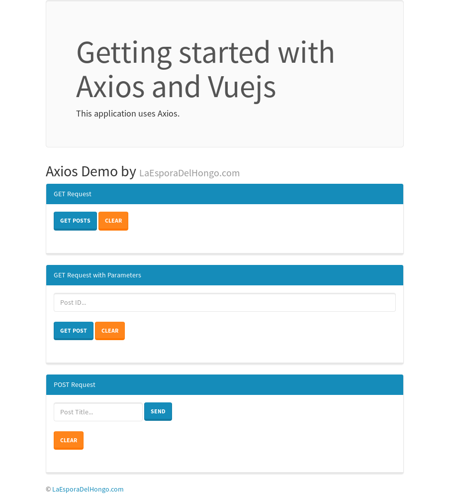
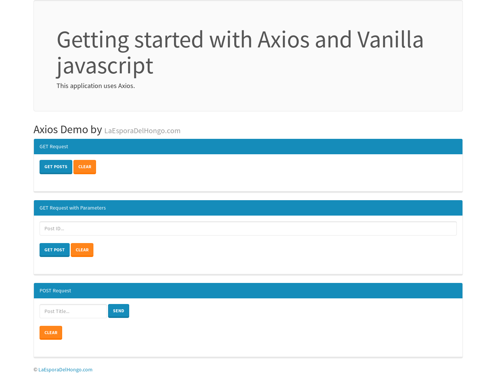

# First steps with Axios and Vue

> Example project





## Build Setup

``` bash
# install dependencies
npm install

# serve with hot reload at localhost:8080
npm run dev

# build for production with minification
npm run build
```

For detailed explanation on how things work, consult the [blog]( http://laesporadelhongo.com/primeros-pasos-con-axios/).
